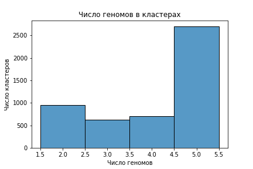

Таксон: Betaproteobacteria
Genus: Herbaspirillum

Ссылка на [коллаб](https://colab.research.google.com/drive/1C7AIrSm8ncnrIzmaxo2I2hH6tmXHZn4a?usp=sharing) 

### Анализ аннотированных генов

| Вид | Кол-во последовательностей | Число аннотированных генов | Процент аннотированных генов в геноме| Число участков Z-DNA | Длина участков Z-DNA |
|---------|-------|------|------|------|------|
|  Herbaspirillum hiltneri N3 | 1 | 4965474 | 4584 | 88.96 | 78880 | 764282 |
| Herbaspirillum huttiense | 1 | 5691775 | 5110 | 88.19 | 83320 | 817758 |
| Herbaspirillum robiniae | 1 | 5445269 | 4937 | 87.49 | 118194 | 1151050 |
| Herbaspirillum rubrisubalbicans M1 | 1 |  5611261 | 4910 | 88.85 | 69018 | 672992 |
| Herbaspirillum seropedicae | 2 | 5349998 | 4817 | 89.30 | 78461 | 770500 |

В последнем случае кол-во последовательностей: 2, т.к. есть плазмида, в других местах в таблице она нигде не учтена.
Для Z-DNA учтены только участки, где ZH-score > 500.

Гистограммы ZH-score можно посмотреть в коллабе: Предсказание участков Z-ДНК -> Гистограммы ZH-score. Там 3 варианта гистограмм: по всем участкам с ZH-score > 500; по тем участкам, где к тому же ZH-score < 200 000; < 25000; < 5000. Все гистограммы похожи, и вывод один: большинство участков Z-ДНК имеют ZH-score в районе 500 или 1000. Приводить гистограммы здесь я не стал, т.к. этого не просят в задании.

### Кластеры

Всего кластеров: 4984

Гистограмма кластеров:



Выберем такие кластеры, в которых Z-ДНК попадает в промотеры для всех 5 геномов (я писал в тг, что у меня нет таких кластеров, но потом оказалось, что ошибся, и они нашлись).  Выберем 5 кластеров с лучшим ZH-score.

Таблица по кластерам:

| Кластер | Вид | Белок | Функция белка | ZH-score в промотере| 
|---------|-------|------|------|------|
|1|Herbaspirillum hiltneri N3|WP_053199285.1| DUF2891 domain-containing protein |941334.2 |
||Herbaspirillum huttiense|WP_134222000.1| DUF2891 domain-containing protein|50885.97 |
||Herbaspirillum robiniae|WP_079214389.1| DUF2891 domain-containing protein|211093.9  |
||Herbaspirillum rubrisubalbicans M1|WP_058895002.1| DUF2891 domain-containing protein|68804.91 |
||Herbaspirillum seropedicae|WP_139970603.1| DUF2891 domain-containing protein|38833.58 |
|2|Herbaspirillum hiltneri N3|WP_053198383.1| RNA methyltransferase|2765.963 |
||Herbaspirillum huttiense|WP_134221981.1| RNA methyltransferase|198956.2 |
||Herbaspirillum robiniae|WP_079214355.1| RNA methyltransferase|198956.2 |
||Herbaspirillum rubrisubalbicans M1|WP_058894979.1| RNA methyltransferase|28780.5 |
||Herbaspirillum seropedicae|WP_139970584.1| RNA methyltransferase|198956.2 |
|3|Herbaspirillum hiltneri N3|WP_053197341.1| hypothetical protein| 883.5764 4057.419  2091.083  |
||Herbaspirillum huttiense|WP_039785309.1| hypothetical protein|198956.2 |
||Herbaspirillum robiniae|WP_079214470.1| chemotaxis protein|   883.5764 138924.1       650.9198 |
||Herbaspirillum rubrisubalbicans M1|WP_058896057.1| hypothetical protein|65884.11     883.5764 |
||Herbaspirillum seropedicae|WP_013234942.1| hypothetical protein|9.413342e+05 8.835764e+02 |
|4|Herbaspirillum hiltneri N3|WP_005663428.1| translation initiation factor IF-1|302785.5 |
||Herbaspirillum huttiense|WP_005663428.1| translation initiation factor IF-1|65884.11 |
||Herbaspirillum robiniae|WP_005663428.1| translation initiation factor IF-1|65884.11 |
||Herbaspirillum rubrisubalbicans M1|WP_005663428.1| translation initiation factor IF-1|65884.11 |
||Herbaspirillum seropedicae|WP_005663428.1| translation initiation factor IF-1|65884.11 |
|5|Herbaspirillum hiltneri N3|WP_053197397.1| flavodoxin-dependent (E)-4-hydroxy-3-methylbut-2-enyl-diphosphate synthase|302785.5 |
||Herbaspirillum huttiense|WP_039785356.1| flavodoxin-dependent (E)-4-hydroxy-3-methylbut-2-enyl-diphosphate synthase|  783.823 66470.78  |
||Herbaspirillum robiniae|WP_079214499.1| flavodoxin-dependent (E)-4-hydroxy-3-methylbut-2-enyl-diphosphate synthase|302785.5 |
||Herbaspirillum rubrisubalbicans M1|WP_058896029.1| flavodoxin-dependent (E)-4-hydroxy-3-methylbut-2-enyl-diphosphate synthase|21732.38 |
||Herbaspirillum seropedicae|WP_139971389.1| flavodoxin-dependent (E)-4-hydroxy-3-methylbut-2-enyl-diphosphate synthase| 1008.605 65884.11  |

Все рассматриваемые участки Z-ДНК находятся в промотере. ZH-score – это все значения ZH-score для этих участков. В каждом кластере 5 генов. Функции записаны по файлу proteins.faa. Они совпадают везде, кроме 3го кластера, где большинство hypothetical protein, и один chemotaxis protein. Можно предположить, что на самом деле они все chemotaxis protein, просто это установлено лишь для одного вида.

### Выравнивание

Проводилось с помощью Muscle

<details>
  <summary>Кластер 1</summary>
  ```
>WP_079214389.1 DUF2891 domain-containing protein [Herbaspirillum robiniae]
MQLSIQQAEAFARMPLTYLRQEYPNHIMHVLHGDQDALSPRALHPVFYGCYDWHSAVHGFWLLLRCVHLYPELPAKADIN
TIFDEHFTPELMRRETDYFQVDGRAPFERPYGFGWILALDQELAQSALPNAAAWRQAMQPLTTEIRSRLLAYLSKLSYPI
RVGTHYNTAFALALSLDYARHVQDGELESVIVNAARNYYGNDVDYPAHYEPGGDEYISGGLTEALLMTKALPAGAFQPWF
DKYLPRITEVTQIMQPAHVSDPTDPKIAHLDGLNLSRAWCMKNILRHLHADHPARKAIDDSVERHIKASIDQVVGSHYSG
GHWLASFALLALEG
>WP_058895002.1 DUF2891 domain-containing protein [Herbaspirillum rubrisubalbicans]
MQLTIERAEAFARMPLTYLRQEYPNHIMHLLNGPEDVLSPRAMHPVFYGCYDWHSAVHGYWLLLRCLRLYPGLPAADEIT
ALFDEHFTPDLMERETDYFRAPNRAPFERPYGFAWLLALDQELLVSAHPQARQWHTAMQPLTTEIRRRLLDYLSKLSYPI
RVGAHFNTAFSLALSLDYAHHVQDSELESVIIDWSQRHYGADTDYPAQYEPGGDEFISGALTEALLMSKVMNAEVFPVWF
DQYLPRVAEVAQLMQPAHVSDPTDPKVAHLDGLNLSRAWCMKQVLRHLSTQHPARAALEASAQRHIAASLDQVIGSHYSG
GHWLATFAVLALED
>WP_134222000.1 DUF2891 domain-containing protein [Herbaspirillum huttiense]
MQLTLDRAEQFARMPLAYLRQEYPNHIMHLLNDEGDVLSPRAMHPVFYGCYDWHSAVHGYWLLLRCLRQYPSMAVTDEIT
AIFDEHFTPELMERETDYFRGPNRAPFERPYGFGWLLALDQELLMSAHPRAAEWHAAMKPLTTEIRRRLFDYLSKLSYPI
RVGTHFNTAFSLALALDYARHVTDTELEALIVDWSNQHYGKDTDYPAHYEPGGDEFISGALTEALLMSKVLSSDAFTGWF
DLYLPRIAEVTQITHPAYVSDPTDPKVAHLDGLNLSRAWCMKNVLRHLPAHHAAHSAIEAAIQRHIAASIDQVVGSHYSG
GHWLASFAMLALED
>WP_053199285.1 DUF2891 domain-containing protein [Herbaspirillum hiltneri]
MQLTIELAAAYTEMPLTYLRQEYPNHIMHVLHGAEDVLSPRAMHPVFYGCYDWHSAVHGYWLLLRCAKLYPALPTQDKIT
AIFDEHFTPELMAQETAYFQVGGRASFERPYGFGWILGLAQELAASSHPRAAAWQAAMQPLTLEIRKRLLEYLGKLTYPI
RVGTHYNTAFALALALDYARAAGDSELESAIVQASRNYYGQDVNYPAHYEPGGDEYISAALTEALLMSKVLDATAFPEWF
DTFLPQIDKTERLMQPAQVSDRTDPKIAHLDGLNLSRAWCMKHIARHLPAGHPAQAALSGAIARHLKASVDHVVGSHYSG
GHWLASFALLALED
>WP_139970603.1 DUF2891 domain-containing protein [Herbaspirillum seropedicae]
MQLTLERAEEFARMPLAYLRQEYPNHIMHVLNDAGDVLSPRAMHPVFYGCYDWHSAVHGFWLLLRCVQRYPELPARAEVE
AIFDEHFTPELMERETDYFRVGGRASFERPYGFGWILALDQELAQSTLPRAASWRTAMQPLTLEIRRRLLEYLSKLSYPI
RVGTHYNTAFALALSLDQARHVKDIELEQVILASAQRYYGKDTDYPAHYEPGGDEYISGALTEALLMSKVLSAQAFAAWF
DQYLPRVAEIEQIMQPALVSDPTDPKIAHLDGLNLSRAWCMKTVLRHLPAGHAARSAIEPAIQRHIAASIDQVVGSHYSG
GHWLASFAMLALED
    ```
</details> 

<details>
  <summary>Кластер 2</summary>
  ```
>WP_058894979.1 RNA methyltransferase [Herbaspirillum rubrisubalbicans]
MNKQVSGQSLFSRLRFVLVNTSSPGNIGSAARAIKTMGFSELVLVNPRFPDAVKEDEAIAFASGAIDVLENARIVGSVEE
ALQGCNFAAAVSARLREFSPPVVSPRELAGQLSRDTGLNAALLFGNERFGLPNEVVQKCNALLNIPANPEYSSLNLSQAV
QVLAYECRMTELEVQGGPMQTSGDARAPGEVGFHGQSASVGEIEGMFAHLEQALVAIDFLNPDNPKKLMPRLKRMFSRAQ
LETEEVNILRGIARQILEPKQAKAGKQEQNEQGEG
>WP_053198383.1 RNA methyltransferase [Herbaspirillum hiltneri]
MNTPKIDNSVFKRLRFVLVETSSPGNIGAAARAIKTMGFGELVLINPRFPNAVEEEAAVAFASGAQDVLSGARIVSSIEE
ALQDCNFAAAISARLREFSPPVVSPRAIAGQIAGDVGLKAAMIFGNERFGLPNELVQKCNVLINIPANPDYSSLNLAQAV
QVLAYECRMAEL----------GDRVQAGDIGFQGEMAGVAEIEGMFRHLEEALVAIEFLKPDSPKKLMPRLKRLFARTQ
LETEEVNILRGIARQILTPKQDRKPKQ--------
>WP_079214355.1 RNA methyltransferase [Herbaspirillum robiniae]
MNKQESEHSLFTRLRFVLVNTSSPGNIGSAARAIKTMGFSELVLVNPRFPDAVREDEAVAFASGALDVLQNARVVGSVEE
ALQGCNFAAAVSARLREFSPPVVTPRELAGQLSQDTGLNAALLFGNERFGLPNEVVQKCQALINIPANPDYSSLNLSQAV
QVLAYECRMTELELRGGPMRTSGDARAPGEVGFQGSSAGVAEIEGMFAHLEEALVAIDFLNPDNPKKLMPRLKRMFARAQ
LETEEVNILRGIARQILEPKQAKARKNEEGGPEHG
>WP_134221981.1 RNA methyltransferase [Herbaspirillum huttiense]
MNKQVSGQSLFSRLRFVLVNTSSPGNIGSAARAIKTMGFSELVLVNPRFPDAVKEDEAIAFASGALDVLQNARIVGSVEE
ALQGCNFAAAVSARLREFSPPVVSPRELAGQLSRDTGLNAALLFGNERFGLPNEVVQKCNALLNIPANPDYSSLNLSQAV
QVLAYECRMTELELQGGPMQTSGDARAPGEVGFHGQSASVAEIEGMFAHLEQALVAIDFLNPDNPKKLMPRLKRMFSRAQ
LETEEVNILRGIARQILEPKQAKAGRQEQNEQGEG
>WP_139970584.1 RNA methyltransferase [Herbaspirillum seropedicae]
MNKQVSGQSLFSRLRFVLVNTSSPGNIGSAARAIKTMGFSELVLVNPRFPDAVKEDEAIAFASGALDVLQNARIVGSVEE
ALQGCNFAAAVSARLREFSPPVVSPRELAGQLSRDTGLNAALLFGNERFGLPNEVVQKCNALLNIPANPEYSSLNLSQAV
QVLAYECRMTELEVQGGPMQTSGDARSPGEVGFHGQSASVAEIEGMFAHLEQALVAIDFLNPDNPKKLMPRLKRMFSRAQ
LETEEVNILRGIARQILEPKQAKAGRREQNEQGEG
    ```
</details>  

<details>
  <summary>Кластер 3</summary>
  ```
>WP_058896057.1 hypothetical protein [Herbaspirillum rubrisubalbicans]
MPTKTMLQELKRLLLDTASGGSRQLTEVESDLVQTNILLGEAIGKLGTSFMELHRSVQLQQSILEGLMNGNSQFDGESIE
QLKATQGQVSHYVNAAVTGLQFQDMTSQLLERIVRRVIGLREALGVLSANSFEIVPEQGQTDEELKELLASTVQAMEERL
TVLDSGLWKAVRQTRMESGDIELF
>WP_053197341.1 hypothetical protein [Herbaspirillum hiltneri]
MSTPKMLQELKRLLLDTASGGSRQLTEVETDLVQTNILLGEAIEKLGSSFMELHTAVLAQQKELEVVMAGNGTLSAEDIA
RLKVMQDDITAHVNAAVTGLQFQDMTSQLLERIVRRVIGLRDALGVLSANSFEITPDSTQSVEMLESLLKNTVESMEERL
TALENGLWKTVRQTRMESGDIELF
>WP_079214470.1 chemotaxis protein [Herbaspirillum robiniae]
MPTKTMLHELKRLLLDTASGGSRQLTEVESDLVQTNILLGEAIGKLGTSFMDLHRSVQTQQDILEALMNGHEELNADSIA
KLKETQNQVSQYVNAAVTGLQFQDMTSQLLERIVRRVIGLREALGVLSANSFEIVPEQDQSDVELEALLASTVKSIEERL
TVLDNGLWKAVRQTRMESGDIELF
>WP_039785309.1 MULTISPECIES: hypothetical protein [Herbaspirillum]
MPTKTMLQELKRLLLDTASGGSRQLTEVESDLVQTNILLGEAIGKLGNSFMELHRAVQIQQSILEGLMNGSGQFDSASID
QLKATQGEVSHYVNAAVTGLQFQDMTSQLLERIVRRVIGLREALGVLSANSFEIVPEQGQTDEEVKELLASTVQAIEERL
NMLDTGLWKAVRQTRMESGDIELF
>WP_013234942.1 MULTISPECIES: hypothetical protein [Herbaspirillum]
MPTKTMLQELKRLLLDTASGGSRQLTEVESDLVQTNILLGEAIGKLGTSFMELHRAVQMQQTILEGLMNGSGEINSESIE
QLKDTQGQVSHYVNAAVTGLQFQDMTSQLLERIVRRVIGLREALGVLSANSFEIVPEQGQSNDELQELLASTVQAMEERL
TVLDSGLWKAVRQTRMESGDIELF
    ```
</details> 

<details>
  <summary>Кластер 4</summary>
  ```
>WP_005663428.1 MULTISPECIES: translation initiation factor IF-1 [Oxalobacteraceae] dupelabel2
MAKDDVIQMQGEILENLPNATFRVKLENGHVVLGHISGKMRMNYIRILPGDKVTVELTPYDLSRARIVFRTK
>WP_005663428.1 MULTISPECIES: translation initiation factor IF-1 [Oxalobacteraceae]
MAKDDVIQMQGEILENLPNATFRVKLENGHVVLGHISGKMRMNYIRILPGDKVTVELTPYDLSRARIVFRTK
>WP_005663428.1 MULTISPECIES: translation initiation factor IF-1 [Oxalobacteraceae] dupelabel1
MAKDDVIQMQGEILENLPNATFRVKLENGHVVLGHISGKMRMNYIRILPGDKVTVELTPYDLSRARIVFRTK
>WP_005663428.1 MULTISPECIES: translation initiation factor IF-1 [Oxalobacteraceae] dupelabel3
MAKDDVIQMQGEILENLPNATFRVKLENGHVVLGHISGKMRMNYIRILPGDKVTVELTPYDLSRARIVFRTK
>WP_005663428.1 MULTISPECIES: translation initiation factor IF-1 [Oxalobacteraceae] dupelabel4
MAKDDVIQMQGEILENLPNATFRVKLENGHVVLGHISGKMRMNYIRILPGDKVTVELTPYDLSRARIVFRTK
    ```
</details> 

<details>
  <summary>Кластер 5</summary>
    
  ```
>WP_039785356.1 flavodoxin-dependent (E)-4-hydroxy-3-methylbut-2-enyl-diphosphate synthase [Herbaspirillum huttiense]
MSSF--PIASGPLARRNSRRVVISHGAREILVGGGAPVMVQSMTNTDTADAIGTAIQIKELARAGSEIVRLTVNTPEAAA
AVPAIREQLDRMGVDVPLVGDFHYNGHTLLTDYPECAQALSKYRINPGNVGKGAKRDTQFAQMIEVACKYDKPVRIGVNW
GSLDQALLARIMDENAGRAEPWSAQAVMYEALVTSAIENAQRAEELGMSGDKIILSCKVSGVQDLIAVYRELARRCDYPL
HLGLTEAGMGSKGIVASTAALSVLLQEGIGDTIRISLTPEPGGDRTKEVVVGQEILQTMGLRKFTPMVIACPGCGRTTST
VFQDLADKIQTFLREQMPVWKGKYPGVEAMNVAVMGCIVNGPGESKHANIGISLPGTGESPAAPVFIDGEKKMTLRGERI
AEEFQKVVLEYVESHYGQGSHS
>WP_053197397.1 flavodoxin-dependent (E)-4-hydroxy-3-methylbut-2-enyl-diphosphate synthase [Herbaspirillum hiltneri]
MSSSSFPIASGPLGRRQSRRAVIRYGEREVVVGGGAPVVVQSMTNTDTADAIGTAIQVKDLARAGSEVVRITVNSPEAAA
AVPAIREQLDRMGVDVPLVGDFHYNGHTLLNDYPDCARALSKYRINPGNVGKGAKRDSQFAQMIEAACRYDKPVRIGVNW
GSLDQALLARIMDENAGRAEPWPAQAVMYEALVTSAIENAQRAEELGLAGDKIILSCKVSGVQDLIAVYRELARRCDYPL
HLGLTEAGMGSKGIVASTAALSVLLQEGIGDTIRISLTPEPGGDRTREVIVGQEILQTMGLRKFTPMVIACPGCGRTTST
VFQDLADKIQTYLREQMPQWKGVYPGVESMNVAVMGCIVNGPGESKHANIGISLPGTGESPAAPVFIDGEKRMTLRGERI
AEEFQTIVLDYVQTHYGKQTAA
>WP_079214499.1 flavodoxin-dependent (E)-4-hydroxy-3-methylbut-2-enyl-diphosphate synthase [Herbaspirillum robiniae]
MSSS--PIASGPLVRRNSRRVVISQGAREIVVGGGAPVMVQSMTNTDTADAIGTAIQIKDLARAGSEVVRLTVNTPEAAA
AVPAIREQLDRMGVDVPLVGDFHYNGHTLLTEYPDCAMALAKYRINPGNVGKGAKRDTQFAQMIEVACKYDKPVRIGVNW
GSLDQALLARIMDENAGRAEPWSAQAVMYEALVTSAIENAQRAEELGMAGDKIILSCKVSGVQDLIAVYRELARRCDYPL
HLGLTEAGMGSKGIVASTAALSVLLQEGIGDTIRISLTPEPGGDRTKEVVVGQEILQTMGLRKFTPMVIACPGCGRTTST
VFQDLADKIQTYLRDQMPVWKGKYPGVEGMNVAVMGCIVNGPGESKHANIGISLPGTGESPAAPVFIDGEKKMTLRGERI
AEEFQSVVLDYVQTRYGQGSQA
>WP_058896029.1 flavodoxin-dependent (E)-4-hydroxy-3-methylbut-2-enyl-diphosphate synthase [Herbaspirillum rubrisubalbicans]
MSSS--PIASGPLARRNSRRVVISHGAREIIVGGGAPVMVQSMTNTDTADAIGTAIQIKDLARAGSEVVRLTVNTPEAAA
AVPAIREQLDRMGVDVPLVGDFHYNGHTLLTEYPECAQALSKYRINPGNVGKGAKRDTQFAQMIEVACKYDKPVRIGVNW
GSLDQALLARIMDENAGRAEPWAAQAVMYEALVTSAIENAQRAEELGMAGDKIILSCKVSGVQDLIAVYRELARRCDYPL
HLGLTEAGMGSKGIVASTAALSVLLQEGIGDTIRISLTPEPGGDRTKEVVVGQEILQTMGLRKFTPMVIACPGCGRTTST
VFQDLADKIQTFLREQMPVWKGKYPGVEAMNVAVMGCIVNGPGESKHANIGISLPGTGESPAAPVFIDGEKKMTLRGERI
AEEFQNVVLEYVQSHYGQGSHV
>WP_139971389.1 flavodoxin-dependent (E)-4-hydroxy-3-methylbut-2-enyl-diphosphate synthase [Herbaspirillum seropedicae]
MSSS--PIASGPLVRRNSRRVVISHGGREIVVGGGAPVMVQSMTNTDTADAIGTAIQIKDLARAGSEVVRLTVNTPEAAA
AVPAIREQLDRMGVDVPLVGDFHYNGHTLLTEYPECAQALSKYRINPGNVGKGAKRDTQFAQMIEVACKYDKPVRIGVNW
GSLDQALLARIMDENAGRAEPWSAQAVMYEALVTSAIENAQRAEELGMAGDRIILSCKVSGVQDLIAVYRELARRCDYPL
HLGLTEAGMGSKGIVASTAALSVLLQEGIGDTIRISLTPEPGGDRTKEVVVGQEILQTMGLRKFTPMVIACPGCGRTTST
VFQDLADKIQTFLREQMPVWKGKYPGVEAMNVAVMGCIVNGPGESKHANIGISLPGTGESPAAPVFIDGEKKMTLRGEHI
AEEFQKVVLDYVESHYGQGHPA
    ```
</details> 